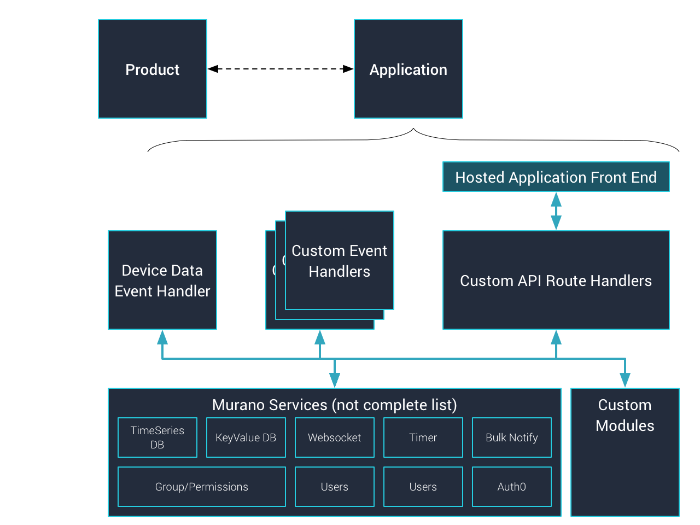

# Murano Device Data Handling Application Note
_Application Note as a Murano Solution_

This application note is actually a Murano solution to demonstrate a few basic Murano features work when sending device data, storing it, and retrieving it via an API.


Murano has two areas to work on when developing an IoT based system - the Product side and the Application side.  The Product side is the standard device connectivity and management you would expect from and IoT platform.  The application side of your solution though allows you to implement a data handler for incoming connected device data, implement your own API for interacting with this data (application front-ends or integrations), and to host application front-end content if necessary.


### Product Side


The Product layer in Murano handles the device management, connectivity, and identity / provisioning management.  Once a product has been set up, identitites are whitelisted (so we know which of potentially thousands of devices is sending data), and devices have provisioned (so we know the devices are who they say they are), they begin sending API requests such as the following using HTTPS:

```
POST /onep:v1/stack/alias HTTP/1.1
Host: example.m2.exosite.io
X-Exosite-CIK: <token>
Content-Type: application/x-www-form-urlencoded; charset=utf-8
Content-Length: <length>
<blank line>
<resource 1>=<value 1>&<resource 2...>=<value 2...>&<resource n>=<value n>
```

This application note is not focused on discussing all of the functionality of the Product layer, but wanted to quick mention it.

### Application Side


